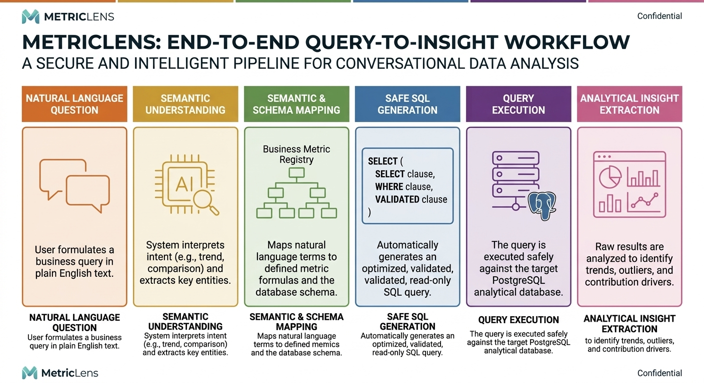

# MetricLens

An AI analytics copilot that turns plain-English business questions into validated SQL, insights, and conversational answers.

## Why This Project Exists

Business teams need answers quickly, but traditional BI workflows require SQL skills, dashboard maintenance, and analyst bandwidth.

MetricLens solves this by combining:
- Natural-language understanding for analytics intent
- Semantic metric mapping and business rules
- Guarded SQL generation and execution
- Insight extraction (trends, anomalies, drivers)
- Conversational explanation in a chat interface

This means users can ask questions like "Why did revenue drop this week?" and get reliable, explainable answers without writing SQL.

## Architecture Diagrams

Add your two hackathon diagrams to these paths so they render in this README:
- Full architecture: `docs/architecture-full.png`
- Backend layers: `docs/backend-layers.png`

Then they will appear below.

### Full System Architecture


### Backend Layered Architecture



## What We Built

### 1. Conversational Analytics Experience
- Authenticated chat interface for asking business questions
- Conversation history and thread continuity
- Follow-up aware query handling

### 2. Query Understanding Layer
- Intent classification (`compare`, `breakdown`, `trend`, `summary`, `driver_analysis`)
- Entity and metric linking from user language
- Time-window parsing for business phrasing (week-over-week, last month, etc.)

### 3. Semantic Layer
- Metric registry with controlled definitions and aggregation logic
- Dimension hierarchy mapping user terminology to canonical data fields
- Business rules that keep calculations consistent and meaningful

### 4. Agentic SQL Pipeline
- LLM-assisted SQL generation
- SQL validation and safety constraints
- Read-only execution path on PostgreSQL
- Retry/repair behavior for robustness

### 5. Insight Engine
- Trend detection
- Outlier detection
- Contribution (driver) analysis
- Chart recommendation payloads for UI rendering

### 6. RAG + Vector Retrieval
- Retrieval from schema docs, metric docs, and sample queries
- Better answers for "what is" and definition/policy-style questions

### 7. Caching and Performance
- Semantic cache for similar question reuse
- Result cache for repeated query outputs

### 8. Full-Stack Integration
- Next.js frontend with API routes and auth
- FastAPI backend orchestration
- Prisma models for users, conversations, and messages

## Repository Structure

```text
backend/
	main.py                     # FastAPI entrypoint and orchestration pipeline
	agents/                     # SQL generation, validation, response, guard rails, RAG
	layers/                     # Query understanding, semantic layer, planning, execution, insights
	utils/                      # Gemini client/embedder, logging, error models
	data/                       # Schema docs, metric docs, sample queries

frontend/
	src/app/                    # Next.js app routes, auth pages, chat pages, API routes
	src/components/             # Chat UI, answer rendering, landing sections
	src/lib/                    # Prisma client, NextAuth options, utilities
	prisma/schema.prisma        # User/conversation/message data models
```

## Quick Setup For Evaluators

## Prerequisites
- Node.js 20+
- Python 3.10+
- PostgreSQL connection string (Neon or compatible)
- Gemini API key

## 1. Clone

```bash
git clone <your-repo-url>
cd cfpbot
```

## 2. Backend Setup

```bash
cd backend
python -m venv .venv
```

Windows (PowerShell):

```powershell
.\.venv\Scripts\Activate.ps1
```

Install dependencies:

```bash
pip install -r requirements.txt
```

Create `backend/.env`:

```env
GEMINI_API_KEY=your_gemini_api_key
DATABASE_URL=your_postgres_connection_string
CACHE_THRESHOLD=0.92
SEMANTIC_CACHE_TTL_HOURS=1
```

Run backend:

```bash
uvicorn main:app --reload --port 8000
```

Backend health check:

```text
http://localhost:8000/api/health
```

## 3. Frontend Setup

Open a second terminal:

```bash
cd frontend
npm install
npx prisma generate
npm run dev
```

Create `frontend/.env` (minimum):

```env
DATABASE_URL=your_postgres_connection_string
NEXTAUTH_SECRET=your_nextauth_secret
NEXTAUTH_URL=http://localhost:3000
BACKEND_URL=http://localhost:8000
```

Open:

```text
http://localhost:3000
```

## 4. Optional Data Ingestion

If your database is empty, load data from CSV:

```bash
cd backend
python ingest.py --csv data/orders.csv
```

## API Endpoints (Backend)

- `POST /api/query` - Main analytics question endpoint
- `GET /api/summary` - Summary endpoint
- `GET /api/health` - Health and service counters
- `GET /api/metrics` - Metric definitions
- `DELETE /api/cache` - Clear semantic and result caches

## Why This Is a Strong Solution

- Accurate: semantic and business-rule layers reduce metric ambiguity
- Safe: SQL validation and controlled execution path
- Explainable: narrative responses plus chart-ready insights
- Fast: caching and precompute-compatible architecture
- Practical: clean full-stack integration with authentication and persistent conversations

## Demo flow:
Live project: http://cfp-bot.vercel.app

1. Open the live project and sign up / sign in
2. Create a conversation
3. Ask a trend question
4. Ask a breakdown question
5. Ask a definition question (RAG path)

Recommended example prompts:
- "Compare revenue this month vs last month"
- "Break down order volume by channel"
- "What is average order value and how is it calculated?"
- "Why did sales change this week?"


