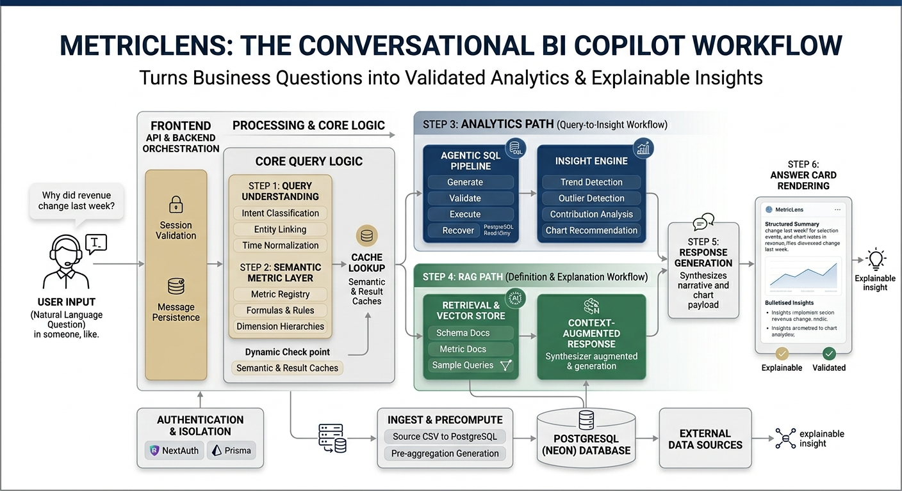

# MetricLens — Conversational Financial Performance Bot

> **NatWest Hackathon Submission** · Built for financial analysts who need instant, accurate answers from transaction data — no SQL required.

---

## What is MetricLens?

MetricLens is an **AI-powered analytics chatbot** purpose-built for financial data. It lets analysts ask plain-English questions like *"Why did mobile transactions drop last week?"* and receive data-backed, narrative answers with charts — in under a second.

The core design principle: **the LLM never calculates numbers — it only narrates results.** Every figure comes from real SQL against real data. The AI is used for language understanding and storytelling, not arithmetic.

---

## Architecture at a Glance



---

## The 7-Layer Backend Pipeline

Every user question travels through a deterministic pipeline before a single LLM token is generated. This guarantees accuracy — numbers are never hallucinated.

```
User Question: "Why did mobile transactions drop last week?"
        │
        ▼
┌───────────────────────────────────────────────────────────────┐
│  LAYER 0 — Semantic Cache                                      │
│  Cosine similarity check (threshold 0.92) against past asks   │
│  Cache HIT  → return instantly, skip all layers below         │
│  Cache MISS → continue                                        │
└───────────────────────────────────────────────────────────────┘
        │ miss
        ▼
┌───────────────────────────────────────────────────────────────┐
│  LAYER 1 — Query Understanding                                 │
│  rules classifier → entity linker → time parser               │
│  LLM called ONLY if ambiguity_score > 0.7                     │
│                                                                │
│  Output → StructuredRequest                                    │
│  { intent, metrics[], dimensions[], time_window,              │
│    output_type, ambiguity_score, prior_request }              │
└───────────────────────────────────────────────────────────────┘
        │ ambiguity > 0.7 → return CLARIFY question to user
        ▼
┌───────────────────────────────────────────────────────────────┐
│  LAYER 2 — Semantic Layer                                      │
│  Resolves metric name → SQL fragments + business rules         │
│  "Revenue" always means SUM(Amount) WHERE Type = 'Credit'     │
│  Enforces COUNT(DISTINCT AccountID) for unique customer counts │
│                                                                │
│  Output → ResolvedMetric                                       │
│  { sql_fragment, joins, filters, time_logic, lineage }        │
└───────────────────────────────────────────────────────────────┘
        │
        ▼
┌───────────────────────────────────────────────────────────────┐
│  LAYER 3 — Query Planner                                       │
│  Decides routing strategy:                                     │
│    pre_agg  → pre-aggregated Parquet (fastest)                │
│    raw_sql  → live DuckDB query                               │
│    rag      → definition / policy lookup                      │
│  Plans comparison baselines, driver decomposition             │
│                                                                │
│  Output → ExecutionPlan                                        │
│  { route, queries[], needs_driver_analysis,                   │
│    needs_significance_test, comparison_period }               │
└───────────────────────────────────────────────────────────────┘
        │
        ▼
┌───────────────────────────────────────────────────────────────┐
│  LAYER 3b — SQL Generator + Validator                          │
│  Generates SQL from ExecutionPlan via Gemini                  │
│  Validates output — no LLM on validation path                 │
│  Retries up to 2× with exponential backoff                    │
│  Concurrency limited via Semaphore(4) to protect API quota    │
└───────────────────────────────────────────────────────────────┘
        │
        ▼
┌───────────────────────────────────────────────────────────────┐
│  LAYER 4 — Fast Execution Engine (DuckDB)                      │
│  Columnar in-process analytics — 10–100x faster than Postgres  │
│  Falls back to PostgreSQL automatically on error               │
│  Pre-aggregated Parquet files for common rollups               │
│  Result cache for repeated exact queries                       │
│                                                                │
│  Output → RawResults { rows[], columns[], execution_ms }      │
└───────────────────────────────────────────────────────────────┘
        │
        ▼
┌───────────────────────────────────────────────────────────────┐
│  LAYER 5 — Insight Engine  (pure Python/numpy — zero LLM)     │
│  trend_detector    → direction, % change, peak/trough period  │
│  outlier_detector  → z-score anomaly flagging                 │
│  contribution_analyzer → top driver identification            │
│  chart_recommender → picks bar/line/table from intent         │
│                                                                │
│  Output → StructuredInsights                                   │
│  { key_finding, anomalies[], drivers[], trends[],             │
│    chart_spec, source_tables[], execution_ms }                │
└───────────────────────────────────────────────────────────────┘
        │
        ▼
┌───────────────────────────────────────────────────────────────┐
│  LAYER 6 — Response Generator  (Gemini)                        │
│  Reads StructuredInsights — does NOT recalculate              │
│  Produces: plain-English narrative + source citations          │
│  Guard rail check → filters hallucinated numbers              │
│  Stores result back in semantic cache                          │
│                                                                │
│  Output → Final JSON Payload                                   │
│  { answer, chart_spec, confidence, sources[], trace }         │
└───────────────────────────────────────────────────────────────┘
        │
        ▼
     User sees narrative answer + chart
```

---

## RAG Path (for Policy / Definition Questions)

When the question is definitional ("What does chargeback rate mean?") the pipeline skips SQL entirely:

```
Question → ChromaDB vector search
              ├── schema_docs   (column definitions)
              ├── metric_docs   (business metric definitions)
              └── sample_queries (similar past SQL examples)
                        │
                        ▼
                 Context injected → Gemini → Narrative answer
```

---

## Technology Stack

### Frontend

| Layer | Technology |
|---|---|
| Framework | Next.js 16.2 (App Router) |
| UI Language | TypeScript + React 19 |
| Styling | Tailwind CSS v4 |
| Animations | Framer Motion 12 |
| Auth | NextAuth v4 (credentials provider) |
| ORM | Prisma 7 (PostgreSQL adapter) |
| Icons | Tabler Icons + Lucide React |
| Components | Custom: wavy-background, glowing-effect, hero-highlight, draggable-card |

### Backend

| Layer | Technology |
|---|---|
| API Server | FastAPI (Python) |
| LLM | Google Gemini (SQL generation + response narration) |
| Analytics DB | DuckDB (columnar, in-process, 10–100x faster than row-store) |
| Persistence DB | PostgreSQL via Neon (serverless) |
| Vector Store | ChromaDB (RAG document retrieval) |
| Numerical Analysis | NumPy (trend detection, outlier scoring, contribution analysis) |
| Session State | In-memory session store with 30-min TTL auto-expiry |
| Caching | Semantic cache (cosine similarity, threshold 0.92) + exact result cache |

### Data Model (PostgreSQL — Prisma)

```
User ──────── Conversation ──────── Message
 │                                     │
 │  id (cuid)                         role: USER | ASSISTANT | SYSTEM
 │  email (unique)                    content (JSON payload)
 │  hashedPassword (bcrypt)           conversationId
 │  createdAt / updatedAt             createdAt
 └──► conversations[]
```

---

## Key Engineering Decisions

### 1. LLM Used Sparingly
Gemini is called in only two places: SQL generation (Layer 3b) and response narration (Layer 6). All classification, validation, trend detection, and outlier analysis run as deterministic Python — this makes the system fast, auditable, and hallucination-resistant.

### 2. DuckDB as the Analytics Engine
PostgreSQL is great for transactional workloads. For analytics aggregations over millions of rows, DuckDB's columnar engine is 10–100x faster. The backend queries DuckDB first and falls back to Postgres automatically — the frontend never knows the difference.

### 3. Two-Level Caching
- **Semantic cache** (Layer 0): cosine similarity at 0.92 threshold — similar questions return instantly
- **Result cache**: exact SQL result memoization — identical queries skip the DB entirely

### 4. Follow-up Conversation Awareness
Every session stores the last 5 `StructuredRequest` objects. When a user asks *"break that down by region"*, the Query Understanding layer inherits the previous metric and time window — no need to repeat context.

### 5. Business Rule Enforcement
The Semantic Layer enforces hard rules that analysts forget:
- Revenue = `SUM(Amount) WHERE Type = 'Credit'` — never total debits
- Unique customers = `COUNT(DISTINCT AccountID)` — never row count
- Fraud exclusion applied automatically unless explicitly asked about fraud

---

## Project Structure

```
MetricLens/
├── frontend/                         Next.js 16 app
│   ├── src/
│   │   ├── app/
│   │   │   ├── (auth)/               signin / signup pages
│   │   │   ├── (pages)/chat/         chat UI + server actions
│   │   │   └── api/
│   │   │       ├── auth/             NextAuth route handler
│   │   │       ├── chat/             proxies to FastAPI backend
│   │   │       ├── conversations/    CRUD for conversations
│   │   │       ├── register/         user registration
│   │   │       └── summary/          weekly executive summary
│   │   ├── components/
│   │   │   └── ui/                   wavy-bg, glowing-effect, sidebar, etc.
│   │   └── lib/                      auth-options, prisma client, utils
│   └── prisma/schema.prisma          DB schema (User, Conversation, Message)
│
└── backend/                          FastAPI Python service
    ├── main.py                       API routes + pipeline orchestrator
    ├── layers/
    │   ├── query_understanding/      intent classifier, entity linker, time parser
    │   ├── semantic_layer/           metric registry, business rules, dimension hierarchy
    │   ├── query_planner/            route decider, execution plan builder, result merger
    │   ├── execution/                DuckDB engine, PostgreSQL fallback, result cache
    │   ├── insight_engine/           trend detector, outlier detector, contribution analyzer,
    │   │                             chart recommender
    │   ├── semantic_cache.py         cosine-similarity cache (threshold 0.92)
    │   ├── conversation.py           session store with 30-min TTL
    │   └── agent_engine.py           agentic query orchestrator
    ├── agents/
    │   ├── rag_retriever.py          ChromaDB RAG context builder
    │   ├── response_generator.py     Gemini narrative generator
    │   ├── guard_rail.py             hallucination filter
    │   └── reasoning_chain.py        structured reasoning object
    ├── utils/
    │   ├── gemini_client.py          Gemini wrapper (backoff + semaphore)
    │   ├── errors.py                 typed error codes + recoverable flag
    │   └── logger.py                 per-layer trace logger
    └── data/
        ├── transactions.csv          source transaction data
        ├── schema_docs.txt           column documentation for RAG
        ├── metrics.json              metric definitions for RAG
        └── sample_queries.json       example Q&A pairs for RAG
```

---

## API Reference

### `POST /api/query`
Main analytics pipeline. Accepts a plain-English question and returns a structured answer.

**Request**
```json
{
  "question": "What were the top 5 revenue channels last month?",
  "session_id": "optional-uuid-for-conversation-continuity"
}
```

**Response (analytics)**
```json
{
  "answer":     "The top revenue channel last month was Online Banking at £2.4M...",
  "chart_spec": { "type": "bar", "x": "channel", "y": "revenue" },
  "confidence": 0.95,
  "sources":    ["transactions"],
  "trace":      { "query_understanding": 12, "execution": 38, "total_ms": 210 },
  "from_cache": false,
  "session_id": "abc-123",
  "request_id": "uuid"
}
```

**Response (clarification needed)**
```json
{
  "clarify":  true,
  "question": "Did you mean transactions by channel or by product type?"
}
```

### `GET /api/summary`
Returns a weekly executive summary narrative.

### `GET /api/health`
Returns system status: DB row count, vector store document counts, cache entries.

### `GET /api/metrics`
Returns the full metric dictionary with definitions and SQL fragments.

### `DELETE /api/cache`
Clears semantic and result caches (useful for demo resets).

---

## Running Locally

### Backend

```bash
cd backend
python -m venv venv
source venv/bin/activate        # Windows: venv\Scripts\activate
pip install -r requirements.txt

# Set environment variables
cp .env.example .env
# Fill in: GEMINI_API_KEY, DATABASE_URL

# Ingest data
python ingest.py --csv data/transactions.csv

# Start server
uvicorn main:app --reload --port 8000
```

### Frontend

```bash
cd frontend
npm install

# Set environment variables
cp .env.example .env.local
# Fill in: DATABASE_URL, NEXTAUTH_SECRET, FASTAPI_URL=http://localhost:8000

# Run DB migrations
npx prisma migrate dev

# Start dev server
npm run dev
```

Open [http://localhost:3000](http://localhost:3000)

---

## Example Questions MetricLens Can Answer

| Question | Pipeline Path |
|---|---|
| "What was total revenue last week?" | analytics → DuckDB → trend |
| "Which region had the most transactions in June?" | analytics → DuckDB → contribution |
| "Why did mobile payments drop on Tuesday?" | analytics → driver analysis → outlier |
| "Compare this month vs last month" | analytics → comparison plan → significance test |
| "Break that down by product type" | follow-up → inherits prior context → DuckDB |
| "What does chargeback rate mean?" | RAG → ChromaDB → Gemini |
| "Give me a weekly executive summary" | summary endpoint → full pipeline |

---

## Guard Rails & Safety

- **Hallucination filter**: the guard rail agent inspects Gemini's narrative and removes any number that doesn't appear in `StructuredInsights`. The LLM is not trusted to produce figures.
- **SQL injection prevention**: all SQL is generated by Gemini against a validated schema and executed read-only on DuckDB.
- **Fraud data exclusion**: business rules automatically exclude flagged accounts from clean metrics unless the question explicitly asks about fraud.
- **Session isolation**: each user's conversation history is keyed by session ID and auto-expires after 30 minutes.
- **Auth enforcement**: every `/api/chat` call verifies a valid NextAuth session before touching the database or calling the backend.

---

## Team

Built for the NatWest Hackathon by **Saksham Gupta**.
